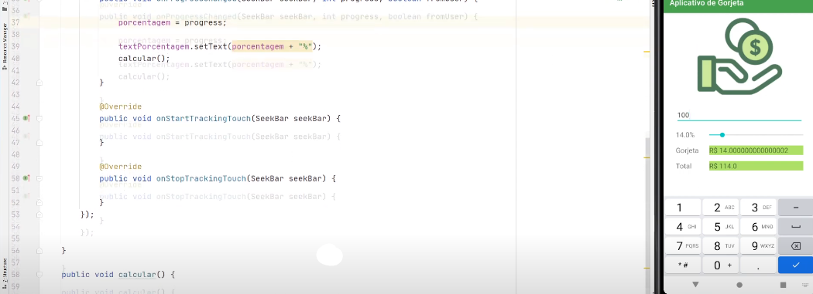

# APP DE GORJETA
👨‍🏫PROJETO CRIADO PARA O CURSO DE ANDROID STUDIO EM JAVA.

  

## DESCRIÇÃO:
O aplicativo "App de Gorjeta" permite que os usuários calculem facilmente a gorjeta e o total da conta em um restaurante. Com uma interface simples e intuitiva, os usuários podem inserir o valor da conta e ajustar a porcentagem da gorjeta usando um controle deslizante. O aplicativo calcula automaticamente a gorjeta com base na porcentagem selecionada e exibe o valor total a pagar, fornecendo uma maneira conveniente de dividir a conta.

## FUNCIONALIDADES:
1. **Entrada do Valor da Conta:**
   - Os usuários podem inserir o valor total da conta em um campo de texto numérico.

2. **Ajuste da Porcentagem da Gorjeta:**
   - Um controle deslizante (SeekBar) permite aos usuários selecionar a porcentagem desejada para a gorjeta.
   - A porcentagem selecionada é exibida em tempo real para fornecer feedback visual ao usuário.

3. **Cálculo Automático da Gorjeta e Valor Total:**
   - O aplicativo calcula automaticamente o valor da gorjeta com base no valor da conta e na porcentagem selecionada.
   - O valor total a pagar, incluindo a gorjeta, é exibido imediatamente após a alteração da porcentagem da gorjeta.

## EXECUTANDO O PROJETO
### INSTALANDO O APK:
   - **Download do APK**: Acesse a pasta `./APK/` e encontre o arquivo `NomeDoApp.apk`.
   - **Transferência para o dispositivo**: Transfira o arquivo APK para o seu dispositivo Android. Isso pode ser feito via cabo USB, Google Drive, email ou qualquer outro método de transferência de arquivos.
   - **Instalação**:
     1. No dispositivo Android, vá para `Configurações` > `Segurança` e habilite a opção `Fontes desconhecidas` (Isso permite a instalação de aplicativos fora da Google Play Store).
     2. Navegue até o local onde o APK foi salvo (usando um gerenciador de arquivos).
     3. Toque no arquivo `NomeDoApp.apk` para iniciar a instalação.
     4. Siga as instruções na tela para concluir a instalação.
   - **Execução**: Após a instalação, você pode abrir o aplicativo diretamente da tela de instalação ou encontrá-lo na gaveta de aplicativos do seu dispositivo.

### ANDROID STUDIO:
#### ABRINDO O PROJETO:
   - **Preparação do ambiente**:
     1. Certifique-se de que você tenha o [Android Studio](https://developer.android.com/studio) instalado em sua máquina.
     2. Instale as dependências necessárias (SDKs, emuladores, etc.) conforme indicado pela documentação do Android Studio.

   - **Abrindo o projeto no Android Studio**:
     1. Abra o Android Studio.
     2. Na tela de boas-vindas, selecione `Open an existing project`.
     3. Navegue até o diretório `./CODIGO` onde o projeto foi clonado e selecione-o.
     4. Aguarde enquanto o Android Studio indexa o projeto e baixa as dependências necessárias.

   - **Executando o projeto**:
     1. Conecte um dispositivo Android via USB ou configure um emulador de dispositivo Android no Android Studio.
     2. Certifique-se de que o dispositivo/emulador está selecionado na barra de dispositivos do Android Studio.
     3. Clique no botão `Run` (ícone de play) para compilar e executar o aplicativo.

   - **Depuração**:
     - Para iniciar a depuração, clique no botão `Debug` (ícone de inseto) e siga as instruções do Android Studio para definir pontos de interrupção e inspecionar variáveis.

#### GERANDO O APK:
   Depois de melhorar o projeto, você pode gerar o APK novamente. Siga os passos abaixo para gerar o APK usando o Android Studio:

   1. **Abrir o Projeto**:
      - Abra o Android Studio.
      - Vá para `File` > `Open...` e selecione o diretório `./CODIGO` do seu projeto.

   2. **Construir o Projeto**:
      - Certifique-se de que todas as dependências estejam atualizadas e que o projeto esteja compilando corretamente.
      - Vá para `Build` > `Clean Project` para limpar o projeto.
      - Depois, vá para `Build` > `Rebuild Project` para reconstruir o projeto.

   3. **Gerar o APK**:
      - Vá para `Build` > `Build Bundle(s) / APK(s)` > `Build APK(s)`.
      - O Android Studio começará a compilar o projeto e a gerar o APK.
      - Após a conclusão, uma notificação aparecerá no canto inferior direito da tela com a mensagem `APK(s) generated successfully.`
      - Clique na notificação ou vá para `locate` para encontrar o APK gerado, que geralmente está localizado em `./app/build/outputs/apk/release/`.

   4. **Testar o APK**:
      - Transfira o APK gerado para o seu dispositivo Android e instale-o conforme as instruções na seção **EXECUTANDO O PROJETO** > **APK** acima.

## CREDITOS:
- [PROJETO FEITO PELO VILHALVA](https://github.com/VILHALVA)
- [PROJETO CRIADO PARA O CURSO DE ANDROID STUDIO EM JAVA](https://github.com/VILHALVA/CURSO-DE-ANDROID-STUDIO-EM-JAVA)

